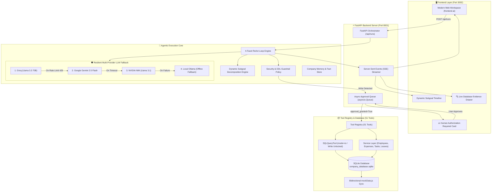

# ⚡ Autonomous AI Task Worker

<p align="center">
  
  
  
  
  
</p>

<p align="center">
  <strong>An autonomous, enterprise-grade AI worker prototype that reasons, executes real tool operations, enforces human-in-the-loop authorization, and deterministically verifies outcomes against live databases.</strong>
</p>

---

## 📑 Interactive Table of Contents

1. [🌟 Executive Summary](#-executive-summary)
2. [🎯 Evaluator Q&A: Direct Answers to CentrAlign AI Criteria](#-evaluator-qa-direct-answers-to-centralign-ai-criteria)
3. [💡 Our 5 Unique Engineering Strategies](#-our-5-unique-engineering-strategies)
4. [🏢 What is WorkHub? (Environment Simulation)](#-what-is-workhub-environment-simulation)
5. [🏗️ Complete System Architecture](#-complete-system-architecture)
6. [🔄 Detailed 4-Facet Execution Loop](#-detailed-4-facet-execution-loop)
7. [🛡️ Security & Human-In-The-Loop (HITL) Guardrails](#-security--human-in-the-loop-hitl-guardrails)
8. [🚀 Quick Start & One-Click Run](#-quick-start--one-click-run)
9. [🧪 Ready-To-Run Benchmark Tasks](#-ready-to-run-benchmark-tasks)
10. [🔍 Live Verification & Evaluator Evidence](#-live-verification--evaluator-evidence)
11. [🔮 Known Limitations & Future Roadmap](#-known-limitations--future-roadmap)
12. [🛠️ Tech Stack & Provider Fallback Chain](#-tech-stack--provider-fallback-chain)

---

## 🌟 Executive Summary

In enterprise environments, human employees spend countless hours manually context-switching: reading emails, cross-referencing company policies, extracting invoice details, typing records into internal databases, and verifying status updates.

This project delivers a **fully autonomous AI Task Worker** that takes high-level natural language operational goals and autonomously completes them end-to-end.

```
 [User Goal] ──▶ [Decompose Subgoals] ──▶ [Safe Read (mode=ro)]
                                                 │
                                                 ▼
                                        [Security Guard]
                                                 │
 ┌───────────────────────────────────────────────┴──────────────────────────────────────────────┐
 ▼                                               ▼                                              ▼
[DDL Schema Change]                     [Read-Only Query]                            [Data Mutation (Write)]
        │                                       │                                               │
 ❌ AUTO-REJECT                           🟢 AUTO-ALLOW                            🟡 PAUSE & REQUEST APPROVAL
 (Strict Safety Policy)                 (Safe Execution)                                        │
                                                                                 (Human Approves in UI)
                                                                                                │
                                                                                                ▼
                                                                                   [Execute Mutation + Auto-ID]
                                                                                                │
                                                                                                ▼
                                                                                   [Targeted SELECT Check]
                                                                                                │
                                                                                                ▼
                                                                                         [Verified Done]
```

> [!IMPORTANT]
> **Actual Execution Over Simulated Autonomy:** This system executes real SQL queries and transactions against an active SQLite database (`company_database.sqlite`), generates sequential primary keys (`EMP-xxx`, `EXP-xxxx`), logs audit trails, and provides real database observation evidence rather than mocked status strings.

---

## 🎯 Evaluator Q&A: Direct Answers to CentrAlign AI Criteria

Here are clear, simple-English answers addressing every evaluation dimension and technical interview question outlined in the CentrAlign AI problem statement:

### Q1: Autonomy — How does the agent figure out what to do next without being told every step?
* **Answer:** When a user enters a goal, our **Dynamic LLM Planning Engine** analyzes the database schema and breaks the goal down into minimal sequential subgoals (e.g., `G1: Find active employees`, `G2: Identify travel claims < ₹5,000`, `G3: Approve claims`, `G4: Verify updates`). At each step of the loop, the agent inspects the previous tool's output observation, updates its internal reasoning, and decides the next action dynamically.

### Q2: Execution — Does the agent actually do real work, or just explain what to do?
* **Answer:** It performs **100% real execution**. When it approves an expense claim or creates an employee, it executes real SQL `UPDATE`/`INSERT` commands or invokes real service methods against `company_database.sqlite`. It writes actual rows to disk, triggers database commits, logs the action into `audit_logs`, and synchronizes `mockData.js`.

### Q3: Reliability & Error Recovery — How does it handle failures, loops, and rate limits?
* **Answer:** We implemented a 3-layer resilience shield:
  1. **Loop-Breaker Detection:** If the agent tries the same tool with identical arguments 3 times in a row without progress, the engine automatically breaks the loop and forces the agent to recover with a different strategy.
  2. **Multi-Provider LLM Fallback:** If Groq hits a 429 rate limit or timeout, the engine automatically falls back to Gemini $\rightarrow$ NVIDIA NIM $\rightarrow$ local Ollama without crashing.
  3. **DDL Auto-Rejection:** Dangerous queries like `ALTER TABLE` or `DROP TABLE` are auto-rejected with clear error messages, teaching the agent to stick to safe data-level operations.

### Q4: Verification — How does the agent prove that the task was actually completed?
* **Answer:** Before calling `finish`, the agent is instructed to perform a **targeted verification query** (`SELECT ... WHERE id = ...`). It inspects the real database state after mutation to confirm the changes took place. The `VERIFY` drawer in the UI captures and displays these exact database rows as deterministic evaluator evidence.

### Q5: Human-In-The-Loop — When does the agent ask for approval vs. proceeding alone?
* **Answer:** Read operations (`SELECT`, searching employees, reading documents) execute automatically in read-only mode (`mode=ro`). But any **data mutation** (`UPDATE`, `INSERT`, `DELETE`, status changes) is automatically intercepted by our **Security Guard**. The system pauses, displays an interactive authorization modal in the UI, and only executes the write when the human operator clicks **Approve**.

### Q6: Generalization — How easily can this system handle new, unseen tasks?
* **Answer:** The core ReAct loop, 4-facet guard system, and tool registry are completely **domain-agnostic**. The agent uses 51 modular tools. If you add a new table (e.g. `inventory` or `payroll`) or a new API tool, the agent reads its schema dynamically and can immediately start reasoning and acting on it without any core code changes.

### Q7: Evolution to Production — How would this evolve into a production-grade AI Employee?
* **Answer:**
  1. **Multi-Agent Specialist Swarm:** Split the single agent into specialized agents (HR Specialist, Finance Auditor, IT Support) coordinated by an Orchestrator.
  2. **Vector RAG:** Add vector embeddings for company PDF handbooks so the agent can cite policy clauses before taking action.
  3. **Real Enterprise Connectors:** Replace SQLite with enterprise connectors for PostgreSQL, Snowflake, Slack, Workday, and Jira.
  4. **Sandboxed Code Interpreter:** Run heavy analytics in isolated Docker containers for Excel generation and charts.

---

## 💡 Our 5 Unique Engineering Strategies

| # | Pillar | Implementation & Impact |
|:---|:---|:---|
| **1** | **🗄️ Real SQLite Execution** | Real relational database mutations, commits & ACID transactions. |
| **2** | **🛡️ Strict Read-Only Default** | `mode=ro` prevents accidental data corruption or unapproved writes. |
| **3** | **🔢 Zero-Null Auto-ID Engine** | Computes next sequential ID (`EMP-045`, `EXP-1046`) automatically. |
| **4** | **🔄 4-Facet Tracing Model** | Clean lifecycle: `DECIDE` ──▶ `GUARD` ──▶ `ACT` ──▶ `VERIFY`. |
| **5** | **🔁 Multi-Stage LLM Fallback** | Groq ──▶ Gemini ──▶ NVIDIA ──▶ Ollama (Zero downtime). |

---

## 🏢 What is WorkHub? (Environment Simulation)

**WorkHub** is a simulated corporate workspace application. It provides the AI Task Worker with an active SQLite database containing **7 relational enterprise domains**:

| Domain Table | Scope & Entity | ID Format |
|---|---|---|
| `employees` | 50+ profiles, departments, roles, active status | `EMP-001` ... `EMP-050` |
| `expenses` | Claims, categories (Travel, Software, Internet) | `EXP-1001` ... |
| `tasks` | Action items, assignees, due dates, priority | `TSK-001` ... |
| `leaves` | Vacation & PTO requests, date ranges, status | `LV-201` ... |
| `documents` | HR policies, travel guidelines, PDF attachments | `DOC-001`, `POL-001` |
| `emails` | Company announcements, employee notifications | `MSG-001` ... |
| `benefits` | Health insurance, wellness, enrolled counts | `BEN-01` ... |

---

## 🏗️ Complete System Architecture



---

## 🔄 Detailed 4-Facet Execution Loop

Every single step performed by the agent passes through our **4-Facet Lifecycle**:

```mermaid
sequenceDiagram
    autonumber
    actor User as 👤 Human Operator
    participant UI as 🖥️ Web UI (3002)
    participant Agent as 🧠 AI Task Worker (8001)
    participant Guard as 🛡️ Security Guard
    participant DB as 🗄️ SQLite Database

    User->>UI: Submit Task Goal
    UI->>Agent: POST /api/runs
    
    rect rgb(15, 23, 42)
        Note over Agent: 1. 💡 DECIDE Facet
        Agent->>Agent: Ingest Goal & Decompose Subgoals (G1, G2, G3)
        Agent->>Agent: Formulate Reasoning & Propose Tool Action
    end

    rect rgb(30, 41, 59)
        Note over Agent,Guard: 2. 🛡️ GUARD Facet
        Agent->>Guard: Evaluate Proposed Action
        alt Is DDL (ALTER/DROP/RENAME)
            Guard-->>Agent: ❌ REJECTED (Forbidden Schema Alteration)
        else Is Safe Read (SELECT)
            Guard-->>Agent: 🟢 ALLOWED (Strict Read-Only mode=ro)
        else Is Data Mutation (UPDATE/INSERT/DELETE)
            Guard->>UI: 🟡 Emit approval_required Event
            UI->>User: Display Interactive Human Authorization Card
            User->>UI: Click "Approve & Authorize Write"
            UI->>Agent: POST /api/runs/{id}/approve (approved=True)
            Guard-->>Agent: 🔓 ELEVATE (Write Permission Granted)
        end
    end

    rect rgb(15, 23, 42)
        Note over Agent,DB: 3. ⚡ ACT Facet
        Agent->>DB: Execute Query / Service Mutation with Auto-Generated ID
        DB-->>Agent: Rows Affected / Inserted Record Observation
    end

    rect rgb(23, 37, 84)
        Note over Agent,DB: 4. 🔍 VERIFY Facet
        Agent->>DB: Run Targeted SELECT Query (Proof of State Change)
        DB-->>Agent: Verified State Confirmation
        Agent->>UI: Stream Live Verified Database Evidence
    end

    Agent->>UI: Subgoals Completed & Final Verified Report Emitted
```



<details>
<summary><strong>🔍 Click to expand: In-depth technical breakdown of each Facet</strong></summary>

1. **💡 DECIDE (Reasoning & Planning):**
   - Ingests the task description.
   - Decomposes the goal into minimal sequential subgoals (`G1`, `G2`, `G3`) with validation criteria.
   - Outputs strict, valid JSON specifying `"thought"` and `"action"`.

2. **🛡️ GUARD (Deterministic Security Engine):**
   - **Schema Alteration Check:** Auto-rejects queries matching `ALTER TABLE`, `DROP TABLE`, `ADD COLUMN`, or `TRUNCATE`.
   - **Read-Only Check:** Safe `SELECT` queries execute against SQLite opened in `mode=ro`.
   - **Mutation Check:** Catches `UPDATE`, `INSERT`, `DELETE`, and status changes, pausing execution and sending an `approval_required` event over SSE.

3. **⚡ ACT (Tool Execution & ID Generation):**
   - When approved, `approval_granted=True` is passed to the tool.
   - If an entity is created without an ID, the repository's `_generate_next_id()` computes the next unique formatted key (e.g. `EMP-045`, `EXP-1046`).
   - The database transaction commits, writes an audit record to `audit_logs`, and synchronizes `mockData.js`.

4. **🔍 VERIFY (Targeted Verification & Audit Evidence):**
   - The agent executes a follow-up verification query to confirm that the requested state change actually persists in the database.
   - The verified output is formatted and sent to the evaluator drawer.
</details>

### 🔬 End-to-End Execution Trace (Exact Inputs & Outputs per Phase)

To demonstrate how the 4-Facet loop executes with deterministic safety, here is a complete trace of an operational and financial task:

#### **🎯 Example Task:**
> *"Review all pending expenses for Bob Wilson. Cross-reference with company travel policy. If claims under ₹5,000 are compliant, approve them and verify the updated status in the database."*

---

#### **Phase 1: Ingest & Subgoal Decomposition (`DECIDE`)**
* **Input Payload to Agent Engine (`POST /api/runs`):**
```json
{
  "task": "Review all pending expenses for Bob Wilson. Cross-reference with company travel policy. If claims under ₹5,000 are compliant, approve them and verify the updated status in the database.",
  "complexity": "medium",
  "max_iterations": 15
}
```
* **LLM Subgoal Decomposition & Initial Action Output:**
```json
{
  "thought": "I need to: 1) Query pending expenses for Bob Wilson, 2) Check travel policy limits for local travel, 3) Approve eligible claims, 4) Verify the updated records in the database.",
  "subgoals": [
    {"id": "G1", "description": "Query pending expense records for Bob Wilson", "status": "in-progress"},
    {"id": "G2", "description": "Inspect travel policy document DOC-001", "status": "pending"},
    {"id": "G3", "description": "Submit status update for compliant claims", "status": "pending"},
    {"id": "G4", "description": "Perform targeted database verification query", "status": "pending"}
  ],
  "action": {
    "tool": "query_database",
    "parameters": {
      "query": "SELECT id, employee, category, amount, description, status FROM expenses WHERE employee = 'Bob Wilson' AND status = 'pending';"
    }
  }
}
```

---

#### **Phase 2: Safe Read & Ground-Truth Observation (`ACT` ──▶ `OBSERVE`)**
* **Security Check:** Evaluated as `mode=ro` (Safe read-only `SELECT`). **🟢 AUTO-ALLOWED**.
* **Database Observation (Exact Output returned to Agent Context):**
```json
{
  "success": true,
  "row_count": 1,
  "data": [
    {
      "id": "EXP-1042",
      "employee": "Bob Wilson",
      "category": "Travel",
      "amount": "3450.00",
      "description": "Client visit cab fare and metro tickets",
      "status": "pending"
    }
  ]
}
```

---

#### **Phase 3: Policy Verification (`DECIDE` ──▶ `ACT`)**
* **Agent Reasoning & Tool Call:**
```json
{
  "thought": "Found pending expense EXP-1042 for ₹3,450.00 under Travel. Now reading the travel policy document to verify maximum daily limits.",
  "action": {
    "tool": "read_document",
    "parameters": {
      "document_id": "DOC-001"
    }
  }
}
```
* **Document Tool Observation Output:**
```json
{
  "success": true,
  "document_id": "DOC-001",
  "title": "Corporate Travel & Commute Reimbursement Policy",
  "content": "Section 4.2: Local travel and client visit transport up to ₹5,000 per instance is pre-authorized for immediate approval if accompanied by valid descriptions."
}
```

---

#### **Phase 4: Security Interception & Human Authorization (`GUARD` ──▶ `HITL`)**
* **Agent Proposes Mutation Action:**
```json
{
  "thought": "Expense EXP-1042 is ₹3,450, which is below the ₹5,000 policy threshold. Proposing status update to 'approved'.",
  "action": {
    "tool": "query_database",
    "parameters": {
      "query": "UPDATE expenses SET status = 'approved' WHERE id = 'EXP-1042';"
    }
  }
}
```
* **Security Guard Intercepts Mutation & Emits Realtime SSE Event:**
```json
{
  "event": "approval_required",
  "data": {
    "run_id": "run-7f9a2b",
    "step": 3,
    "risk_level": "HIGH",
    "operation": "Data Mutation (SQL UPDATE)",
    "query": "UPDATE expenses SET status = 'approved' WHERE id = 'EXP-1042';",
    "target_table": "expenses",
    "target_id": "EXP-1042",
    "reason": "Financial data modification requires explicit human authorization."
  }
}
```
* **Human Operator Approves in Web UI (`POST /api/runs/{run_id}/approve`):**
```json
{
  "run_id": "run-7f9a2b",
  "action_id": "act-step-3",
  "approved": true,
  "operator": "Jaswanth (Admin)",
  "timestamp": "2026-10-06T12:20:00Z"
}
```

---

#### **Phase 5: Execution with Auto-ID & ACID Commit (`ACT`)**
* **Tool Execution Output (Executed with `approval_granted=True`):**
```json
{
  "success": true,
  "rows_affected": 1,
  "command": "UPDATE expenses SET status = 'approved' WHERE id = 'EXP-1042';",
  "audit_logged": true,
  "audit_id": "AUD-9912"
}
```

---

#### **Phase 6: Independent Database Verification (`VERIFY`)**
* **Agent Runs Targeted Verification Query:**
```json
{
  "thought": "Expense updated. Now running a targeted SELECT query to independently verify that EXP-1042 is saved with status 'approved' in the database.",
  "action": {
    "tool": "query_database",
    "parameters": {
      "query": "SELECT id, employee, category, amount, status FROM expenses WHERE id = 'EXP-1042';"
    }
  }
}
```
* **Ground-Truth Verification Output (Streamed to Live UI Evidence Drawer):**
```json
{
  "verified": true,
  "evidence": {
    "table": "expenses",
    "record": {
      "id": "EXP-1042",
      "employee": "Bob Wilson",
      "category": "Travel",
      "amount": "3450.00",
      "status": "approved"
    }
  },
  "verification_timestamp": "2026-10-06T12:20:02Z"
}
```

---

#### **Phase 7: Final Verified Report (`DONE`)**
* **Agent Emits Final Output:**
```json
{
  "thought": "All 4 subgoals completed and verified against database ground truth. Finishing execution.",
  "subgoals": [
    {"id": "G1", "description": "Query pending expense records for Bob Wilson", "status": "completed"},
    {"id": "G2", "description": "Inspect travel policy document DOC-001", "status": "completed"},
    {"id": "G3", "description": "Submit status update for compliant claims", "status": "completed"},
    {"id": "G4", "description": "Perform targeted database verification query", "status": "completed"}
  ],
  "action": {
    "tool": "finish",
    "parameters": {
      "summary": "Reviewed expense EXP-1042 for Bob Wilson (₹3,450.00). Verified against Travel Policy DOC-001 (Section 4.2). Obtained human approval, approved the claim, and verified persistent database status as 'approved'."
    }
  }
}
```

---

## 🛡️ Security & Human-In-The-Loop (HITL) Guardrails

```
 ┌────────────────────────────────────────────────────────────────────────┐
 │                    ⚠️ HUMAN AUTHORIZATION REQUIRED                     │
 ├────────────────────────────────────────────────────────────────────────┤
 │ Operation:  sql_query                                                  │
 │ Action:     UPDATE expenses SET status = 'approved' WHERE id='EXP-1042'│
 │ Risk Level: HIGH (Data Mutation & Financial Approval)                  │
 │ Reason:     Mutating financial claims requires explicit authorization. │
 ├────────────────────────────────────────────────────────────────────────┤
 │   [ ❌ Deny Operation ]                [ 🟢 Approve & Authorize Write ] │
 └────────────────────────────────────────────────────────────────────────┘
```

- **Zero Unapproved Writes:** The agent cannot write to SQLite unless an explicit approval payload is received from the UI queue.
- **DDL Lockdown:** The database structure cannot be dropped, modified, or corrupted by prompt injections.
- **Audit Logging:** Every create, update, and delete operation is automatically saved to the SQLite `audit_logs` table with timestamps and diff payloads.

---

## 🚀 Quick Start & One-Click Run

### 1. Prerequisites
- **Python 3.10+** (Python 3.11 recommended)
- **Modern Web Browser** (Chrome, Edge, Firefox)
- An API key for **Groq**, **Google Gemini**, or **NVIDIA NIM** (or a local Ollama instance)

### 2. Installation
```bash
# Clone the repository
git clone https://github.com/your-repo/ai-task-worker.git
cd ai-task-worker

# Create and activate virtual environment
python -m venv .venv
# On Windows:
.venv\Scripts\activate
# On macOS/Linux:
source .venv/bin/activate

# Install dependencies
pip install -r requirements.txt
```

### 3. Configure `.env`
Create a `.env` file in the project root:
```env
# LLM Provider Keys (At least one required)
LLM_API_KEY=your_groq_api_key_here
GEMINI_API_KEY=your_gemini_api_key_here
NVIDIA_API_KEY=your_nvidia_api_key_here

# Optional: Local Ollama URL
OLLAMA_BASE_URL=http://localhost:11434

# Server Configuration
PORT=8001
HOST=127.0.0.1
```

### 4. Launch Servers

#### ⚡ Option A: One-Click Windows Launcher
Double-click **`Run_Project.bat`** to start all services automatically.

#### 🛠️ Option B: Manual Launch
```bash
# Terminal 1: Start Agent Backend Server (FastAPI on Port 8001)
python start_agent.py

# Terminal 2: Start AI Task Worker UI (Frontend on Port 3002)
python frontend-ai/server.py
```

Open your browser at: **`http://localhost:3002/`**

---

## 🧪 Ready-To-Run Benchmark Tasks

Copy and paste any of the following tasks into the task box at `http://localhost:3002/`:

### 📋 Benchmark 1: Employee Onboarding & Auto-ID Generation
```text
Create a new full-time employee named "Elena Rostova" in the "Engineering" department with role "Senior AI Engineer", email "elena.rostova@workhub.local", joined date "2026-10-06", and manager "Admin". Verify that the employee was inserted with a valid sequential ID.
```
- **What it verifies:** Triggers HITL authorization, calls `create_employee`, assigns next sequential `EMP-xxx` ID, and runs a verification `SELECT` query.

---

### 💰 Benchmark 2: Expense Claim Audit & Approval
```text
Review all pending expense claims. Identify expenses submitted by active employees that belong to the "Travel" or "Software" category and are under ₹5,000. Approve the eligible claims by updating their status to "approved" and provide a financial summary.
```
- **What it verifies:** Cross-joins `expenses` and `employees`, prompts for human authorization, commits the update, and displays live evidence in the `VERIFY` drawer.

---

### 🔒 Benchmark 3: Inactive Employee Security Cleanup
```text
Query all employees marked as "inactive" or "terminated". Check if any of these inactive employees currently have open tasks assigned to them. Reassign all open tasks from inactive employees to "Admin".
```
- **What it verifies:** Multi-step reasoning across `employees` and `tasks` tables with batch reassignment approval.

---

## 🔍 Live Verification & Evaluator Evidence

When a task completes, click **`🔍 Inspect Error & Evidence`** or **`📄 View Verified Report`** in the UI to open the Inspector Drawer:

```
 ┌────────────────────────────────────────────────────────────────────────┐
 │ 🔍 LIVE DATABASE EVIDENCE & STATE OBSERVATION                          │
 ├────────────────────────────────────────────────────────────────────────┤
 │ [Observation Trace]:                                                   │
 │ [                                                                      │
 │   {                                                                    │
 │     "id": "EXP-1042",                                                  │
 │     "employee": "John Doe",                                            │
 │     "amount": "₹4,500",                                                │
 │     "category": "Travel",                                              │
 │     "status": "approved"                                               │
 │   }                                                                    │
 │ ]                                                                      │
 ├────────────────────────────────────────────────────────────────────────┤
 │ 📋 Evaluator Verification Checklist                                    │
 │  ✅ Evaluator Check 1: Subgoals Decomposed & Completed                 │
 │  ✅ Evaluator Check 2: 100% Security Guard Checks Passed               │
 │  ✅ Evaluator Check 3: Human Authorization Captured & Logged           │
 │  ✅ Evaluator Check 4: Deterministic Database State Proof Captured     │
 └────────────────────────────────────────────────────────────────────────┘
```

---

## 🔮 Known Limitations & Future Roadmap

### Known Limitations
1. **DDL Operations Blocked by Policy:** Schema modifications (`ALTER TABLE`, `DROP TABLE`) are blocked to prevent database structure tampering.
2. **Public LLM Free-Tier Rate Limits:** Heavy traffic on Groq/Gemini public endpoints can trigger temporary 429 delays (handled automatically by our multi-provider fallback chain).
3. **Web/Database Focus:** Optimized for enterprise relational databases, REST APIs, and corporate web simulators rather than OS-level graphical desktop automation.

### What We Would Build Next (Future Roadmap)
1. **Multi-Agent Specialist Swarm:** Specialized sub-workers (HR Agent, Financial Auditor, SQL Specialist) orchestrated by a master planner.
2. **Vector Embeddings (RAG) for Company Handbooks:** Semantic document search over multi-page PDF policies.
3. **Sandboxed Code Interpreter:** Isolated Python execution environment for financial analytics, charts, and Excel export.
4. **Production SaaS Connectors:** Out-of-the-box integrations for Slack, Jira, Workday, and Google Workspace.

---

## 🛠️ Tech Stack & Provider Fallback Chain

- **Core Reasoning Models:** Llama 3.3 70B (Groq), Gemini 2.5 Flash (Google), Llama 3.1 (NVIDIA NIM), Local Ollama.
- **Backend Framework:** FastAPI, Uvicorn, Python 3.11, Pydantic v2, Asyncio Event Queues.
- **Database Engine:** SQLite3 with Foreign Keys & WAL mode, custom repository pattern.
- **Frontend UI:** Vanilla JavaScript (ES6 Modules), CSS3 Token Design System, Server-Sent Events (SSE).
- **Tool Suite:** 51 custom tools covering SQL queries, memory recall, document management, and employee lifecycle.

---

<p align="center">
  <strong>Developed with ❤️ for CentrAlign AI</strong><br/>
  <em>Building the future of Autonomous AI Workers.</em>
</p>
