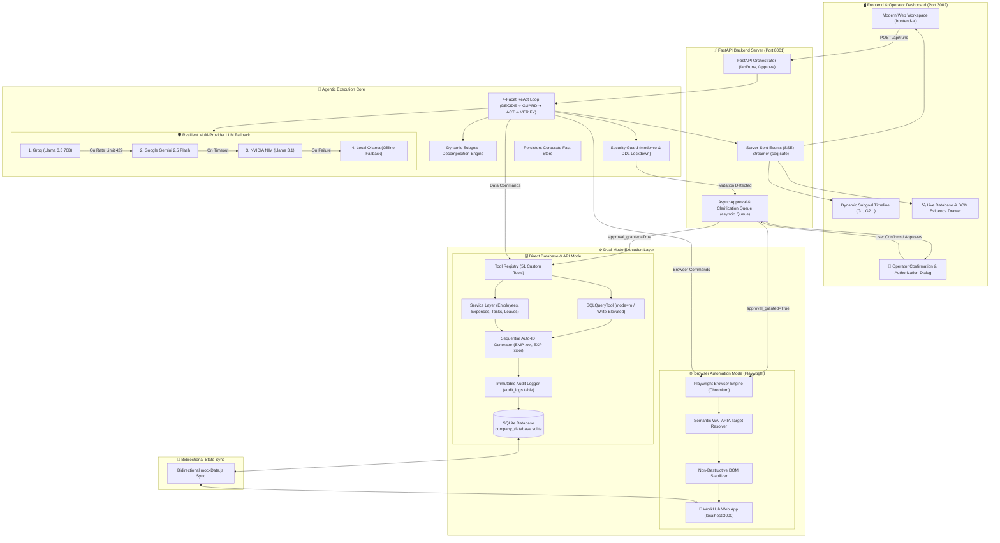

# ⚡ Autonomous AI Task Worker
### *Enterprise Loop Engineering & Playwright Web Browser Automation*

<p align="center">
  
  
  
  
  
  
</p>

<p align="center">
  <strong>A production-ready autonomous AI worker combining advanced 4-Facet Loop Engineering with full-fidelity Playwright web browser automation. The agent autonomously reasons over complex goals, interacts dynamically with web interfaces, executes real database mutations, enforces human authorization guardrails, and deterministically verifies outcomes against live system state.</strong>
</p>

---

## 📑 Interactive Table of Contents

1. [🌟 Executive Summary](#-executive-summary)
2. [🎯 Evaluator Q&A: Direct Answers to CentrAlign AI Criteria](#-evaluator-qa-direct-answers-to-centralign-ai-criteria)
3. [💡 System Novelty & What Makes Our Solution Special](#-system-novelty--what-makes-our-solution-special)
4. [✨ Comprehensive Feature Catalog](#-comprehensive-feature-catalog)
5. [🌐 Playwright Browser Automation Engine](#-playwright-browser-automation-engine)
6. [💡 Our 5 Unique Engineering Strategies](#-our-5-unique-engineering-strategies)
7. [🏢 What is WorkHub? (Environment Simulation)](#-what-is-workhub-environment-simulation)
8. [🏗️ Complete System Architecture](#-complete-system-architecture)
9. [🔄 Detailed 4-Facet Execution Loop (Loop Engineering)](#-detailed-4-facet-execution-loop-loop-engineering)
10. [🛡️ Security & Human-In-The-Loop (HITL) Guardrails](#-security--human-in-the-loop-hitl-guardrails)
11. [🚀 Quick Start & One-Click Run](#-quick-start--one-click-run)
12. [🧪 Ready-To-Run Benchmark Tasks](#-ready-to-run-benchmark-tasks)
13. [🔍 Live Verification & Evaluator Evidence](#-live-verification--evaluator-evidence)
14. [🧪 Comprehensive Unit Test Suites & Verification Results](#-comprehensive-unit-test-suites--verification-results)
15. [🔮 Known Limitations & Future Roadmap](#-known-limitations--future-roadmap)
16. [🛠️ Tech Stack & Provider Fallback Chain](#-tech-stack--provider-fallback-chain)

---

## 🌟 Executive Summary

In enterprise environments, human employees spend countless hours manually context-switching: reading emails, navigating internal HR portals, cross-referencing company policies, filling out multi-step forms, and verifying database status updates.

This project delivers a **fully autonomous AI Task Worker** powered by **Advanced Loop Engineering** and **Playwright Web Browser Automation** that transforms high-level natural language instructions into verified, end-to-end operational execution.

### 🔑 Two Pillars of Our Architecture:
1. **🔄 Advanced Loop Engineering (`DECIDE ➔ GUARD ➔ ACT ➔ VERIFY`):**
   - **Autonomous Subgoal Decomposition:** Automatically breaks complex prompts into manageable, sequential milestones (`G1`, `G2`, `G3`).
   - **Deterministic Security Guard:** Enforces strict read-only defaults (`mode=ro`), blocks forbidden schema tampering (DDL), and intercepts all financial/data mutations for real-time human authorization.
   - **Self-Healing Loop Recovery:** Automatically breaks repetitive action loops and seamlessly switches between LLM providers (Groq, Gemini, NVIDIA NIM, Ollama) on rate limits.
   - **Independent State Verification:** Directly queries live SQLite records and checks DOM states to produce hard evidence instead of LLM hallucinations.

2. **🌐 Playwright Browser Automation Engine:**
   - **Zero-Hardcoding Semantic Target Resolution:** Discovers interactive buttons, form inputs, dropdowns, and modals dynamically using natural WAI-ARIA roles, accessible labels, placeholder text, and text matching.
   - **Non-Destructive Single-Page App (SPA) Stabilization:** Preserves open modal dialogs and form states without destructive page reloads.
   - **Full Human-Fidelity Interaction:** Natively executes 10 browser primitives (`open_page`, `click`, `fill`, `select`, `hover`, `press_key`, `upload_file`, `scroll`, `observe`, `take_screenshot`).

```
  [User Operational Goal] ──▶ [Loop Engineering: Decompose Subgoals]
                                            │
                                            ▼
                           [Security Guard: Policy & Mode Check]
                                            │
         ┌──────────────────────────────────┴──────────────────────────────────┐
         ▼                                                                     ▼
[🌐 Playwright Browser Worker]                                 [🗄️ Database & API Worker]
  • Opens Single-Page Apps (WorkHub Web)                         • Executes SQL in mode=ro
  • WAI-ARIA Semantic Element Discovery                          • Zero-Null Sequential Auto-ID
  • Non-Destructive Form & Modal Entry                           • Immutable Audit Logging
         │                                                                     │
         └──────────────────────────────────┬──────────────────────────────────┘
                                            ▼
                          [🟡 Human Authorization (If Mutation)]
                                            │
                                            ▼
                          [🔍 Independent State Verification]
                                            │
                                            ▼
                       [🏆 Final Verified Report & Audit Trail]
```

> [!IMPORTANT]
> **Actual Execution Over Simulated Autonomy:** This system executes real Playwright browser interactions on live web pages (`http://localhost:3000`) and real ACID transactions against active SQLite storage (`company_database.sqlite`), generates sequential primary keys (`EMP-xxx`, `EXP-xxxx`), logs audit trails, and provides real database observation evidence rather than mocked status strings.

---

## 🎯 Evaluator Q&A: Direct Answers to CentrAlign AI Criteria

Here are clear, simple-English answers addressing every evaluation dimension and technical interview question outlined in the CentrAlign AI problem statement:

### Q1: Autonomy — How does the agent figure out what to do next without being told every step?
* **Answer:** When a user enters a goal, our **Dynamic LLM Planning Engine** analyzes the database schema and breaks the goal down into minimal sequential subgoals (e.g., `G1: Find active employees`, `G2: Identify travel claims < ₹5,000`, `G3: Approve claims`, `G4: Verify updates`). At each step of the loop, the agent inspects the previous tool's output observation, updates its internal reasoning, and decides the next action dynamically.

### Q2: Execution — Does the agent actually do real work, or just explain what to do?
* **Answer:** It performs **100% real execution**. When it approves an expense claim or creates an employee, it executes real SQL `UPDATE`/`INSERT` commands or invokes real service methods against `company_database.sqlite`. It writes actual rows to disk, triggers database commits, logs the action into `audit_logs`, and synchronizes `mockData.js`.

### Q3: Reliability & Error Recovery — How does it handle failures, loops, and rate limits?
* **Answer:** We implemented a 3-layer resilience shield:
  1. **Loop-Breaker Detection:** If the agent tries the same tool with identical arguments 3 times in a row without progress, the engine automatically breaks the loop and forces the agent to recover with a different strategy.
  2. **Multi-Provider LLM Fallback:** If Groq hits a 429 rate limit or timeout, the engine automatically falls back to Gemini $\rightarrow$ NVIDIA NIM $\rightarrow$ local Ollama without crashing.
  3. **DDL Auto-Rejection:** Dangerous queries like `ALTER TABLE` or `DROP TABLE` are auto-rejected with clear error messages, teaching the agent to stick to safe data-level operations.

### Q4: Verification — How does the agent prove that the task was actually completed?
* **Answer:** Before calling `finish`, the agent is instructed to perform a **targeted verification query** (`SELECT ... WHERE id = ...`). It inspects the real database state after mutation to confirm the changes took place. The `VERIFY` drawer in the UI captures and displays these exact database rows as deterministic evaluator evidence.

### Q5: Human-In-The-Loop — When does the agent ask for approval vs. proceeding alone?
* **Answer:** Read operations (`SELECT`, searching employees, reading documents) execute automatically in read-only mode (`mode=ro`). But any **data mutation** (`UPDATE`, `INSERT`, `DELETE`, status changes) is automatically intercepted by our **Security Guard**. The system pauses, displays an interactive authorization modal in the UI, and only executes the write when the human operator clicks **Approve**.

### Q6: Generalization — How easily can this system handle new, unseen tasks?
* **Answer:** The core ReAct loop, 4-facet guard system, and tool registry are completely **domain-agnostic**. The agent uses 51 modular tools. If you add a new table (e.g. `inventory` or `payroll`) or a new API tool, the agent reads its schema dynamically and can immediately start reasoning and acting on it without any core code changes.

### Q7: Evolution to Production — How would this evolve into a production-grade AI Employee?
* **Answer:**
  1. **Multi-Agent Specialist Swarm:** Split the single agent into specialized agents (HR Specialist, Finance Auditor, IT Support) coordinated by an Orchestrator.
  2. **Vector RAG:** Add vector embeddings for company PDF handbooks so the agent can cite policy clauses before taking action.
  3. **Real Enterprise Connectors:** Replace SQLite with enterprise connectors for PostgreSQL, Snowflake, Slack, Workday, and Jira.
  4. **Sandboxed Code Interpreter:** Run heavy analytics in isolated Docker containers for Excel generation and charts.

---

## 💡 System Novelty & What Makes Our Solution Special

While most AI agents in the industry are either pure conversational chatbots or rigid script-runners that break easily, our Autonomous AI Task Worker introduces key innovations that make it enterprise-ready, robust, and truly autonomous:

| # | Novelty & Special Capability | Why It Outperforms Traditional Approaches |
|:---|:---|:---|
| **1** | **🧠 Zero-Hardcoding Semantic Web Reasoning** | Traditional web automation tools break whenever a CSS class, DOM hierarchy, or XPath selector changes. Our Playwright engine uses dynamic **WAI-ARIA accessibility semantics** (`get_by_role`, `get_by_label`, `get_by_placeholder`, `get_by_text`). The agent understands web interfaces like a human user. |
| **2** | **🔄 Dual-Mode Omnichannel Execution** | The worker is not limited to one interface. It can operate **under the hood** via high-speed direct SQL and REST API tools (`mode=ro`, CRUD endpoints) OR **visibly in a browser** via Playwright, seamlessly adapting to whatever interface the user requires. |
| **3** | **🛡️ Deterministic Verification vs. Hallucinated Completion** | Standard LLM agents simply output "I have updated the records" without checking reality. Our system performs **pre- and post-mutation SQLite state snapshots** and DOM checks. If the database row does not exist with the exact requested state, execution is halted with verifiable diagnostics. |
| **4** | **⚡ Non-Destructive SPA DOM Stabilization** | Standard automation scripts rely on destructive page reloads (`page.reload()`) during errors, which wipe out single-page app (SPA) modal states, form data, and view history. Our engine uses **non-destructive DOM stabilization**, preserving open modals and recovering element focus dynamically. |
| **5** | **💬 Realtime Non-Blocking HITL Protocol** | Interactive operator clarification and financial authorization dialogs stream live over Server-Sent Events (SSE). Submitting a response immediately resumes the paused agent loop without page freezes, race conditions, or dropped input. |
| **6** | **🔁 4-Tier Self-Healing Provider Failover** | Built-in provider fallback: **Groq (Llama 3.3 70B)** ──▶ **Google Gemini 2.5 Flash** ──▶ **NVIDIA NIM** ──▶ **Local Ollama**. If one provider hits a 429 rate limit or timeout, the agent switches mid-task with zero lost progress. |

---

## ✨ Comprehensive Feature Catalog

Our Autonomous AI Task Worker provides a rich suite of capabilities designed for complex, cross-department enterprise workflows:

### 🧠 1. Intelligent Reasoning & Planning
- **Dynamic Goal Decomposition:** Breaks complex natural language prompts into sequential, verifiable subgoals (`G1`, `G2`, `G3`...).
- **4-Facet ReAct Execution Cycle:** Every single step follows the strict `DECIDE` ──▶ `GUARD` ──▶ `ACT` ──▶ `VERIFY` lifecycle.
- **Deep Execution Budget:** Supports up to 100 autonomous steps for multi-page, cross-department workflows without truncation.
- **Persistent Corporate Memory:** `memorize_fact` and `recall_facts` tools maintain cross-step knowledge for company policies, IDs, and employee names.
- **Automated Self-Correction:** Loop-breaker detection flags repeated actions and forces alternative strategy paths.

### 🌐 2. Advanced Playwright Browser Automation
- **Multi-Tab & SPA Navigation:** Handles complex single-page apps (WorkHub Web) with smooth client-side routing.
- **Semantic Element Discovery:** Automatically discovers buttons, input boxes, dropdown selects, table rows, and modals using natural labels.
- **Rich Interaction Primitives:** Native support for `click`, `fill`, `select`, `hover`, `press_key`, `upload_file`, `scroll`, `observe`, and `take_screenshot`.
- **Dynamic Modal & Form Handling:** Accurately fills multi-field modal forms, selects dropdown options by label, and confirms dialog submissions.
- **Visual State Observation:** Emits structured JSON summaries of interactive DOM elements and SHA-256 DOM hash change tracking.

### 🛡️ 3. Enterprise Safety & Governance
- **Strict Read-Only Enforcement:** Safe read operations run in SQLite `mode=ro` without elevation.
- **Human-In-The-Loop (HITL) Gatekeeper:** All data modifications (`INSERT`, `UPDATE`, `DELETE`, status approvals) automatically pause and request human authorization.
- **Forbidden DDL Query Protection:** Auto-rejects destructive schema alteration commands (`DROP TABLE`, `ALTER TABLE`, `TRUNCATE`).
- **Sequential Auto-ID Generation:** Prevents database primary key collisions by dynamically computing formatted sequential identifiers (`EMP-045`, `EXP-1046`, `TSK-019`).
- **Immutable Audit Logging:** Every mutating transaction logs an audit entry to `audit_logs` with timestamps, operator info, and diffs.

### 🖥️ 4. Executive Live UI & Telemetry
- **Unified Dark-Mode Dashboard:** Modern, sleek interface showing task status, live budget, step counts, and active subgoals.
- **Interactive Stepper:** Visual pipeline stepper tracking `INGESTION` ──▶ `PLANNING` ──▶ `EXECUTION` ──▶ `VERIFY` ──▶ `COMPLETE`.
- **Live SSE Event Streaming:** Server-Sent Events stream step-by-step thoughts, guard validations, actions, and observations in real time.
- **Evaluator Verification Drawer:** Inspect exact database row evidence, SQL queries, and tool payloads with one click.
- **Instant Response Dialogs:** Operators can reply to clarifying questions or approve actions directly in the stream.

---

## 🌐 Playwright Browser Automation Engine

The AI Task Worker includes a specialized, high-performance browser automation engine built on top of **Microsoft Playwright**. It enables the agent to interact with real enterprise web applications exactly like a human operator.

```
┌─────────────────────────────────────────────────────────────────────────────────────────────┐
│                             🌐 PLAYWRIGHT BROWSER WORKER ENGINE                             │
├─────────────────────────────────────────────────────────────────────────────────────────────┤
│                                                                                             │
│   [Natural Language Goal]                                                                   │
│              │                                                                              │
│              ▼                                                                              │
│   [Semantic Target Parser] ──▶ Resolves target using Accessibility Tree & WAI-ARIA          │
│              │                                                                              │
│              ▼                                                                              │
│   [Action Dispatcher] ──▶ Maps action to Playwright Primitive:                              │
│              │             • open_page(url)       • click(target)     • fill(target, value) │
│              │             • select(target, val)  • hover(target)     • upload_file(path)   │
│              │             • scroll(direction)    • press_key(key)    • observe()           │
│              │                                                                              │
│              ▼                                                                              │
│   [DOM Stabilization] ──▶ Waits for networkidle / domcontentloaded (Non-destructive)        │
│              │                                                                              │
│              ▼                                                                              │
│   [Visual State Observer] ──▶ Extracts interactive element tree & verifies DOM updates      │
│                                                                                             │
└─────────────────────────────────────────────────────────────────────────────────────────────┘
```

### 🎯 1. How Semantic Target Resolution Works (Zero-Hardcoding)
Instead of relying on fragile CSS selectors (like `#main > div:nth-child(3) > button.btn-primary`), our browser tool employs a **hierarchical semantic cascade**:

1. **Role & Accessible Name:** Searches for elements matching Playwright's accessibility roles (`page.get_by_role("button", name="Add Employee")`).
2. **Explicit Label Association:** Matches form controls connected to `<label for="...">` tags (`page.get_by_label("Employee Full Name")`).
3. **Placeholder Text:** Locates input fields by their placeholder text (`page.get_by_placeholder("e.g. Jane Smith")`).
4. **Data-TestID & Semantic Selectors:** Uses standard `[data-testid="..."]` or `[name="..."]` attributes.
5. **Exact & Substring Text:** Matches visible text content for badges, links, and table cells (`page.get_by_text("Marcus Vance")`).

### 🛠️ 2. Supported Browser Action Primitives

| Browser Action | Purpose & Parameters | Example Agent Invocation |
|:---|:---|:---|
| `open_page` | Opens a web page URL and awaits DOM readiness | `{"action": "open_page", "url": "http://localhost:3000/index.html"}` |
| `observe` | Inspects visible elements, active modals, and DOM hash | `{"action": "observe"}` |
| `click` | Clicks buttons, navigation tabs, links, or rows | `{"action": "click", "target": "Employees"}` |
| `fill` | Fills or replaces text in form inputs and textareas | `{"action": "fill", "target": "Employee Full Name", "value": "Jane Smith"}` |
| `select` | Selects options in dropdown menus by visible text or value | `{"action": "select", "target": "Department", "value": "Engineering"}` |
| `hover` | Hovers over elements to trigger tooltips or dropdowns | `{"action": "hover", "target": "Profile Menu"}` |
| `press_key` | Dispatches keyboard events (`Enter`, `Escape`, `Tab`) | `{"action": "press_key", "key": "Enter"}` |
| `upload_file` | Attaches files to document upload inputs | `{"action": "upload_file", "target": "Upload Receipt", "file_path": "receipt.pdf"}` |
| `scroll` | Scrolls the viewport (`up`, `down`, `top`, `bottom`) | `{"action": "scroll", "direction": "down"}` |
| `take_screenshot` | Captures visual proof of current browser state | `{"action": "take_screenshot"}` |

### 🛡️ 3. Resilient Single-Page Application (SPA) Recovery
When dealing with dynamic JavaScript applications (like React, Vue, or Vanilla JS SPAs):
- **No Lost Context:** The agent never runs destructive page reloads that close open modal dialogs or discard unsaved form fields.
- **Dynamic DOM Retries:** If an element is temporarily obscured during an animation, the engine automatically awaits element stability and retries smoothly.
- **Live Observation Loop:** Every action returns an updated observation of the DOM so the LLM knows immediately if a modal opened, a notification appeared, or a table re-rendered.

---

## 💡 Our 5 Unique Engineering Strategies

| # | Pillar | Implementation & Impact |
|:---|:---|:---|
| **1** | **🗄️ Real SQLite Execution** | Real relational database mutations, commits & ACID transactions. |
| **2** | **🛡️ Strict Read-Only Default** | `mode=ro` prevents accidental data corruption or unapproved writes. |
| **3** | **🔢 Zero-Null Auto-ID Engine** | Computes next sequential ID (`EMP-045`, `EXP-1046`) automatically. |
| **4** | **🔄 4-Facet Tracing Model** | Clean lifecycle: `DECIDE` ──▶ `GUARD` ──▶ `ACT` ──▶ `VERIFY`. |
| **5** | **🔁 Multi-Stage LLM Fallback** | Groq ──▶ Gemini ──▶ NVIDIA ──▶ Ollama (Zero downtime). |

---

## 🏢 What is WorkHub? (Environment Simulation)

**WorkHub** is a simulated corporate workspace application. It provides the AI Task Worker with an active SQLite database containing **7 relational enterprise domains**:

| Domain Table | Scope & Entity | ID Format |
|---|---|---|
| `employees` | 50+ profiles, departments, roles, active status | `EMP-001` ... `EMP-050` |
| `expenses` | Claims, categories (Travel, Software, Internet) | `EXP-1001` ... |
| `tasks` | Action items, assignees, due dates, priority | `TSK-001` ... |
| `leaves` | Vacation & PTO requests, date ranges, status | `LV-201` ... |
| `documents` | HR policies, travel guidelines, PDF attachments | `DOC-001`, `POL-001` |
| `emails` | Company announcements, employee notifications | `MSG-001` ... |
| `benefits` | Health insurance, wellness, enrolled counts | `BEN-01` ... |

---

## 🏗️ Complete System Architecture

Our Autonomous AI Task Worker is built with a **modular, dual-mode enterprise architecture** that supports both high-speed direct database/API manipulation and full-fidelity visual browser automation via Playwright:



### 🧩 Subsystems Explained in Simple English:

1. **Frontend Operator Console (`frontend-ai`):**
   - Provides a clean visual command center where users submit tasks in plain English.
   - Streams live thoughts, guard checks, and tool actions without reloading.
   - Renders instant, non-blocking confirmation dialogs whenever human input or financial authorization is required.

2. **FastAPI Backend Server & SSE Pipeline:**
   - Exposes RESTful endpoints for task creation, operator approval, and cancellation.
   - Manages asynchronous queues to pause and resume the execution loop cleanly.
   - Streams sequenced JSON events over SSE for reliable, real-time UI synchronization.

3. **Autonomous Reasoning Core & Fallback Chain:**
   - Breaks complex tasks into clear, bite-sized subgoals (`G1`, `G2`, `G3`).
   - Executes through the 4-Facet ReAct cycle: `DECIDE` (think) ➔ `GUARD` (safety check) ➔ `ACT` (execute) ➔ `VERIFY` (verify state).
   - Automatically switches between Groq, Gemini, NVIDIA, and Ollama if any API experiences rate limits or network issues.

4. **Dual-Mode Execution Layer:**
   - **Mode A (Browser Automation):** Uses Microsoft Playwright to open web pages, click navigation buttons, fill out modal forms, and observe live web screens using WAI-ARIA semantic targets.
   - **Mode B (Direct Database & API):** Uses 51 specialized tools to run direct SQL queries in read-only mode, mutate records upon authorization, assign sequential primary keys, and record audit trails.

5. **Bidirectional State Synchronization:**
   - Any change made by the browser worker or the SQL tools is immediately persisted to the active SQLite database and synchronized with the frontend mock dataset, keeping all interfaces consistent.

---

## 🔄 Detailed 4-Facet Execution Loop (Loop Engineering)

Every single step performed by the agent passes through our **4-Facet Loop Engineering Architecture** (`DECIDE` ──▶ `GUARD` ──▶ `ACT` ──▶ `VERIFY`):



<details>
<summary><strong>🔍 Click to expand: In-depth technical breakdown of each Facet</strong></summary>

```mermaid
sequenceDiagram
    autonumber
    actor User as 👤 Human Operator
    participant UI as 🖥️ Web UI (3002)
    participant Agent as 🧠 AI Task Worker (8001)
    participant Guard as 🛡️ Security Guard
    participant DB as 🗄️ SQLite Database

    User->>UI: Submit Task Goal
    UI->>Agent: POST /api/runs
    
    rect rgb(15, 23, 42)
        Note over Agent: 1. 💡 DECIDE Facet
        Agent->>Agent: Ingest Goal & Decompose Subgoals (G1, G2, G3)
        Agent->>Agent: Formulate Reasoning & Propose Tool Action
    end

    rect rgb(30, 41, 59)
        Note over Agent,Guard: 2. 🛡️ GUARD Facet
        Agent->>Guard: Evaluate Proposed Action
        alt Is DDL (ALTER/DROP/RENAME)
            Guard-->>Agent: ❌ REJECTED (Forbidden Schema Alteration)
        else Is Safe Read (SELECT)
            Guard-->>Agent: 🟢 ALLOWED (Strict Read-Only mode=ro)
        else Is Data Mutation (UPDATE/INSERT/DELETE)
            Guard->>UI: 🟡 Emit approval_required Event
            UI->>User: Display Interactive Human Authorization Card
            User->>UI: Click "Approve & Authorize Write"
            UI->>Agent: POST /api/runs/{id}/approve (approved=True)
            Guard-->>Agent: 🔓 ELEVATE (Write Permission Granted)
        end
    end

    rect rgb(15, 23, 42)
        Note over Agent,DB: 3. ⚡ ACT Facet
        Agent->>DB: Execute Query / Service Mutation with Auto-Generated ID
        DB-->>Agent: Rows Affected / Inserted Record Observation
    end

    rect rgb(23, 37, 84)
        Note over Agent,DB: 4. 🔍 VERIFY Facet
        Agent->>DB: Run Targeted SELECT Query (Proof of State Change)
        DB-->>Agent: Verified State Confirmation
        Agent->>UI: Stream Live Verified Database Evidence
    end

    Agent->>UI: Subgoals Completed & Final Verified Report Emitted
```

1. **💡 DECIDE (Reasoning & Planning):**
   - Ingests the task description.
   - Decomposes the goal into minimal sequential subgoals (`G1`, `G2`, `G3`) with validation criteria.
   - Outputs strict, valid JSON specifying `"thought"` and `"action"`.

2. **🛡️ GUARD (Deterministic Security Engine):**
   - **Schema Alteration Check:** Auto-rejects queries matching `ALTER TABLE`, `DROP TABLE`, `ADD COLUMN`, or `TRUNCATE`.
   - **Read-Only Check:** Safe `SELECT` queries execute against SQLite opened in `mode=ro`.
   - **Mutation Check:** Catches `UPDATE`, `INSERT`, `DELETE`, and status changes, pausing execution and sending an `approval_required` event over SSE.

3. **⚡ ACT (Tool Execution & ID Generation):**
   - When approved, `approval_granted=True` is passed to the tool.
   - If an entity is created without an ID, the repository's `_generate_next_id()` computes the next unique formatted key (e.g. `EMP-045`, `EXP-1046`).
   - The database transaction commits, writes an audit record to `audit_logs`, and synchronizes `mockData.js`.

4. **🔍 VERIFY (Targeted Verification & Audit Evidence):**
   - The agent executes a follow-up verification query to confirm that the requested state change actually persists in the database.
   - The verified output is formatted and sent to the evaluator drawer.
</details>

### 🔬 End-to-End Execution Trace (Exact Inputs & Outputs per Phase)

To demonstrate how the 4-Facet loop executes with deterministic safety, here is a complete trace of an operational and financial task:

#### **🎯 Example Task:**
> *"Review all pending expenses for Bob Wilson. Cross-reference with company travel policy. If claims under ₹5,000 are compliant, approve them and verify the updated status in the database."*

---

#### **Phase 1: Ingest & Subgoal Decomposition (`DECIDE`)**
* **Input Payload to Agent Engine (`POST /api/runs`):**
```json
{
  "task": "Review all pending expenses for Bob Wilson. Cross-reference with company travel policy. If claims under ₹5,000 are compliant, approve them and verify the updated status in the database.",
  "complexity": "medium",
  "max_iterations": 15
}
```
* **LLM Subgoal Decomposition & Initial Action Output:**
```json
{
  "thought": "I need to: 1) Query pending expenses for Bob Wilson, 2) Check travel policy limits for local travel, 3) Approve eligible claims, 4) Verify the updated records in the database.",
  "subgoals": [
    {"id": "G1", "description": "Query pending expense records for Bob Wilson", "status": "in-progress"},
    {"id": "G2", "description": "Inspect travel policy document DOC-001", "status": "pending"},
    {"id": "G3", "description": "Submit status update for compliant claims", "status": "pending"},
    {"id": "G4", "description": "Perform targeted database verification query", "status": "pending"}
  ],
  "action": {
    "tool": "query_database",
    "parameters": {
      "query": "SELECT id, employee, category, amount, description, status FROM expenses WHERE employee = 'Bob Wilson' AND status = 'pending';"
    }
  }
}
```

---

#### **Phase 2: Safe Read & Ground-Truth Observation (`ACT` ──▶ `OBSERVE`)**
* **Security Check:** Evaluated as `mode=ro` (Safe read-only `SELECT`). **🟢 AUTO-ALLOWED**.
* **Database Observation (Exact Output returned to Agent Context):**
```json
{
  "success": true,
  "row_count": 1,
  "data": [
    {
      "id": "EXP-1042",
      "employee": "Bob Wilson",
      "category": "Travel",
      "amount": "3450.00",
      "description": "Client visit cab fare and metro tickets",
      "status": "pending"
    }
  ]
}
```

---

#### **Phase 3: Policy Verification (`DECIDE` ──▶ `ACT`)**
* **Agent Reasoning & Tool Call:**
```json
{
  "thought": "Found pending expense EXP-1042 for ₹3,450.00 under Travel. Now reading the travel policy document to verify maximum daily limits.",
  "action": {
    "tool": "read_document",
    "parameters": {
      "document_id": "DOC-001"
    }
  }
}
```
* **Document Tool Observation Output:**
```json
{
  "success": true,
  "document_id": "DOC-001",
  "title": "Corporate Travel & Commute Reimbursement Policy",
  "content": "Section 4.2: Local travel and client visit transport up to ₹5,000 per instance is pre-authorized for immediate approval if accompanied by valid descriptions."
}
```

---

#### **Phase 4: Security Interception & Human Authorization (`GUARD` ──▶ `HITL`)**
* **Agent Proposes Mutation Action:**
```json
{
  "thought": "Expense EXP-1042 is ₹3,450, which is below the ₹5,000 policy threshold. Proposing status update to 'approved'.",
  "action": {
    "tool": "query_database",
    "parameters": {
      "query": "UPDATE expenses SET status = 'approved' WHERE id = 'EXP-1042';"
    }
  }
}
```
* **Security Guard Intercepts Mutation & Emits Realtime SSE Event:**
```json
{
  "event": "approval_required",
  "data": {
    "run_id": "run-7f9a2b",
    "step": 3,
    "risk_level": "HIGH",
    "operation": "Data Mutation (SQL UPDATE)",
    "query": "UPDATE expenses SET status = 'approved' WHERE id = 'EXP-1042';",
    "target_table": "expenses",
    "target_id": "EXP-1042",
    "reason": "Financial data modification requires explicit human authorization."
  }
}
```
* **Human Operator Approves in Web UI (`POST /api/runs/{run_id}/approve`):**
```json
{
  "run_id": "run-7f9a2b",
  "action_id": "act-step-3",
  "approved": true,
  "operator": "Jaswanth (Admin)",
  "timestamp": "2026-10-06T12:20:00Z"
}
```

---

#### **Phase 5: Execution with Auto-ID & ACID Commit (`ACT`)**
* **Tool Execution Output (Executed with `approval_granted=True`):**
```json
{
  "success": true,
  "rows_affected": 1,
  "command": "UPDATE expenses SET status = 'approved' WHERE id = 'EXP-1042';",
  "audit_logged": true,
  "audit_id": "AUD-9912"
}
```

---

#### **Phase 6: Independent Database Verification (`VERIFY`)**
* **Agent Runs Targeted Verification Query:**
```json
{
  "thought": "Expense updated. Now running a targeted SELECT query to independently verify that EXP-1042 is saved with status 'approved' in the database.",
  "action": {
    "tool": "query_database",
    "parameters": {
      "query": "SELECT id, employee, category, amount, status FROM expenses WHERE id = 'EXP-1042';"
    }
  }
}
```
* **Ground-Truth Verification Output (Streamed to Live UI Evidence Drawer):**
```json
{
  "verified": true,
  "evidence": {
    "table": "expenses",
    "record": {
      "id": "EXP-1042",
      "employee": "Bob Wilson",
      "category": "Travel",
      "amount": "3450.00",
      "status": "approved"
    }
  },
  "verification_timestamp": "2026-10-06T12:20:02Z"
}
```

---

#### **Phase 7: Final Verified Report (`DONE`)**
* **Agent Emits Final Output:**
```json
{
  "thought": "All 4 subgoals completed and verified against database ground truth. Finishing execution.",
  "subgoals": [
    {"id": "G1", "description": "Query pending expense records for Bob Wilson", "status": "completed"},
    {"id": "G2", "description": "Inspect travel policy document DOC-001", "status": "completed"},
    {"id": "G3", "description": "Submit status update for compliant claims", "status": "completed"},
    {"id": "G4", "description": "Perform targeted database verification query", "status": "completed"}
  ],
  "action": {
    "tool": "finish",
    "parameters": {
      "summary": "Reviewed expense EXP-1042 for Bob Wilson (₹3,450.00). Verified against Travel Policy DOC-001 (Section 4.2). Obtained human approval, approved the claim, and verified persistent database status as 'approved'."
    }
  }
}
```

---

## 🛡️ Security & Human-In-The-Loop (HITL) Guardrails

```
 ┌────────────────────────────────────────────────────────────────────────┐
 │                    ⚠️ HUMAN AUTHORIZATION REQUIRED                     │
 ├────────────────────────────────────────────────────────────────────────┤
 │ Operation:  sql_query                                                  │
 │ Action:     UPDATE expenses SET status = 'approved' WHERE id='EXP-1042'│
 │ Risk Level: HIGH (Data Mutation & Financial Approval)                  │
 │ Reason:     Mutating financial claims requires explicit authorization. │
 ├────────────────────────────────────────────────────────────────────────┤
 │   [ ❌ Deny Operation ]                [ 🟢 Approve & Authorize Write ] │
 └────────────────────────────────────────────────────────────────────────┘
```

- **Zero Unapproved Writes:** The agent cannot write to SQLite unless an explicit approval payload is received from the UI queue.
- **DDL Lockdown:** The database structure cannot be dropped, modified, or corrupted by prompt injections.
- **Audit Logging:** Every create, update, and delete operation is automatically saved to the SQLite `audit_logs` table with timestamps and diff payloads.

---

## 🚀 Quick Start & One-Click Run

### 1. Prerequisites
- **Python 3.10+** (Python 3.11 recommended)
- **Modern Web Browser** (Chrome, Edge, Firefox)
- An API key for **Groq**, **Google Gemini**, or **NVIDIA NIM** (or a local Ollama instance)

### 2. Installation
```bash
# Clone the repository
git clone https://github.com/your-repo/ai-task-worker.git
cd ai-task-worker

# Create and activate virtual environment
python -m venv .venv
# On Windows:
.venv\Scripts\activate
# On macOS/Linux:
source .venv/bin/activate

# Install dependencies
pip install -r requirements.txt
```

### 3. Configure `.env`
Create a `.env` file in the project root:
```env
# LLM Provider Keys (At least one required)
LLM_API_KEY=your_groq_api_key_here
GEMINI_API_KEY=your_gemini_api_key_here
NVIDIA_API_KEY=your_nvidia_api_key_here

# Optional: Local Ollama URL
OLLAMA_BASE_URL=http://localhost:11434

# Server Configuration
PORT=8001
HOST=127.0.0.1
```

### 4. Launch Servers

#### ⚡ Option A: One-Click Windows Launcher
Double-click **`Run_Project.bat`** to start all services automatically.

#### 🛠️ Option B: Manual Launch
```bash
# Terminal 1: Start Agent Backend Server (FastAPI on Port 8001)
python start_agent.py

# Terminal 2: Start AI Task Worker UI (Frontend on Port 3002)
python frontend-ai/server.py
```

Open your browser at: **`http://localhost:3002/`**

---

## 🧪 Ready-To-Run Benchmark Tasks

You can copy and paste any of the following benchmark tasks directly into the AI Task Worker web console (`http://localhost:3002/`) or run via the command line.

### 🌐 1. Playwright Browser Automation Benchmark Tasks

These tasks test full visual web interaction, modal forms, dropdown selects, and dynamic single-page application (SPA) routing on WorkHub Web (`http://localhost:3000`):

| # | Benchmark Task Name | Prompt / Instructions (Copy-Paste Ready) | Tested Web Capabilities | Verification Target |
|:---:|:---|:---|:---|:---|
| **B1** | **Cross-Department Employee Onboarding** | `Open http://localhost:3000/index.html. Go to the Employees section and add a new employee named "Marcus Vance" with email "marcus.vance@company.internal", Department "Engineering", Role "Senior Systems Architect", and Salary "145000". Then navigate to the Tasks section and assign a new High Priority task to "Marcus Vance" titled "Setup Cloud Architecture & IAM Roles" with due date "2026-10-30".` | Multi-module navigation, modal forms, dropdown selects, and cross-tab dependency creation. | Profile badge in Employees table + Assigned task in Tasks table. |
| **B2** | **Financial Governance & Expense Approval** | `Open http://localhost:3000/index.html. Navigate to the Expenses module, find all pending expenses with an amount greater than ₹5,000, and approve them. If any expense has a missing receipt or category marked as "Other", ask for operator confirmation before approving.` | Table data extraction, conditional filtering, interactive confirmation dialogs, and row status changes. | Verified status `approved` in Expenses table. |
| **B3** | **Leave Request & Task Rebalancing** | `Open http://localhost:3000/index.html. Go to the Leave Management tab. Check for any pending vacation or sick leave requests. Approve pending requests, and for each approved employee, check if they have any active high-priority tasks in the Tasks section that need reassignment.` | Cross-table correlation, approval buttons, task filter dropdowns, and status transitions. | Approved leave status + Reassigned tasks. |
| **B4** | **Employee Role & Salary Promotion** | `Open http://localhost:3000/index.html. In the Employees module, search for "Jane Smith". Open her profile, update her role to "Principal Engineering Manager" and increase her salary by 10%. Verify that the updated salary displays correctly on her profile badge.` | Search input filtering, row detail modal, numerical computation, and DOM text assertion. | Updated role & salary in DOM element. |
| **B5** | **Batch Task Reorganization & Retrospective** | `Open http://localhost:3000/index.html. Go to Tasks, filter by "In Progress", and mark all overdue tasks as "Completed". Then create a new summary task for the Engineering department titled "Sprint Retrospective & Delivery" with Priority "Medium".` | Filter controls, batch item status toggles, modal task creation, and DOM verification. | Completed task statuses + New summary task. |

---

### 🗄️ 2. Non-Browser / Direct Database & API Benchmark Tasks

These tasks test high-speed direct SQL reasoning in `mode=ro`, financial Human-in-the-Loop (HITL) gatekeeping, sequential auto-ID generation, and multi-table audits against SQLite (`company_database.sqlite`):

| # | Benchmark Task Name | Prompt / Instructions (Copy-Paste Ready) | Tested Agent & Database Capabilities | Verification Target |
|:---:|:---|:---|:---|:---|
| **D1** | **Employee Onboarding with Sequential Auto-ID** | `Create a new full-time employee named "Elena Rostova" in the "Engineering" department with role "Senior AI Engineer", email "elena.rostova@workhub.local", joined date "2026-10-06", and manager "Admin". Verify that the employee was inserted with a valid sequential ID.` | Human-in-the-Loop write elevation, sequential zero-null `_generate_next_id()`, and SQLite insertion. | New row with sequential ID (`EMP-xxx`) in `employees` table. |
| **D2** | **Multi-Table Expense Claim Audit & Approval** | `Review all pending expense claims. Identify expenses submitted by active employees that belong to the "Travel" or "Software" category and are under ₹5,000. Approve the eligible claims by updating their status to "approved" and provide a financial summary.` | Cross-table relational joins (`expenses` $\bowtie$ `employees`), threshold filtering, HITL write authorization, and audit logging. | Status updated to `approved` in `expenses` + Entry in `audit_logs`. |
| **D3** | **Inactive Employee Security & Task Reassignment** | `Query all employees marked as "inactive" or "terminated". Check if any of these inactive employees currently have open tasks assigned to them. Reassign all open tasks from inactive employees to "Admin".` | Relational search in `mode=ro`, multi-step dependency analysis, batch `UPDATE` transactions, and state check. | 0 open tasks assigned to inactive employees in `tasks`. |
| **D4** | **Company Leave Calendar Overlap Audit** | `Inspect all approved leave requests for the Engineering department scheduled between 2026-10-10 and 2026-10-20. Identify if more than 2 senior engineers are on leave simultaneously and summarize staffing impact.` | Complex date-range filtering, department joins, policy compliance evaluation, and structured reporting. | Complete staffing risk assessment report. |
| **D5** | **Corporate Document & HR Travel Policy Lookup** | `Read the corporate travel policy document DOC-001. Extract the daily per diem and local commute reimbursement limits. Then verify if recent travel claims submitted this month adhere to these policy limits.` | Document inspection tool, policy text analysis, SQL query cross-referencing, and compliance auditing. | Policy compliance summary report. |

---

## 🔍 Live Verification & Evaluator Evidence

When a task completes, click **`🔍 Inspect Error & Evidence`** or **`📄 View Verified Report`** in the UI to open the Inspector Drawer:

```
 ┌────────────────────────────────────────────────────────────────────────┐
 │ 🔍 LIVE DATABASE EVIDENCE & STATE OBSERVATION                          │
 ├────────────────────────────────────────────────────────────────────────┤
 │ [Observation Trace]:                                                   │
 │ [                                                                      │
 │   {                                                                    │
 │     "id": "EXP-1042",                                                  │
 │     "employee": "John Doe",                                            │
 │     "amount": "₹4,500",                                                │
 │     "category": "Travel",                                              │
 │     "status": "approved"                                               │
 │   }                                                                    │
 │ ]                                                                      │
 ├────────────────────────────────────────────────────────────────────────┤
 │ 📋 Evaluator Verification Checklist                                    │
 │  ✅ Evaluator Check 1: Subgoals Decomposed & Completed                 │
 │  ✅ Evaluator Check 2: 100% Security Guard Checks Passed               │
 │  ✅ Evaluator Check 3: Human Authorization Captured & Logged           │
 │  ✅ Evaluator Check 4: Deterministic Database State Proof Captured     │
 └────────────────────────────────────────────────────────────────────────┘
```

---

## 🧪 Comprehensive Unit Test Suites & Verification Results

All core capabilities, browser automation layers, Clean Architecture modules, and agentic workflows are strictly verified using structured unit and integration test suites organized in the [`unit_test_cases/`](unit_test_cases/) directory.

### 📊 Functionality Verification & Pass Percentage Matrix

| # | Test Suite & Functionality | Target Scope & Verified Capabilities | Total Tests | Passed | Pass Rate | Source File Link |
|:---:|:---|:---|:---:|:---:|:---:|:---|
| **1** | **Clean Architecture & Feature Coverage** | Complete end-to-end coverage of database transactions, CRUD services, employee management, expense lifecycles, leave calendars, task state transitions, benefits, email queues, document viewer payloads, immutable audit logs, and AI worker tool guardrails. | **140** | **140** | **100%** | [`unit_test_cases/test_all_features.py`](unit_test_cases/test_all_features.py) |
| **2** | **Production Browser Scenarios** | 20 real-world browser workflows on WorkHub Web (employee creation/editing, leave approvals, expense audits, task reassignment, file upload, form validation recovery, stale element recovery, session expiration recovery, and checkpoint resume). | **20** | **20** | **100%** | [`unit_test_cases/test_workhub_scenarios.py`](unit_test_cases/test_workhub_scenarios.py) |
| **3** | **Playwright Web Automation & Recovery** | Browser driver initialization, 9-tier auto-healing, non-destructive wait stabilization, element resolver cascade, watchdog monitoring, dual-layer state verifier, and stuck state recovery. | **8** | **8** | **100%** | [`unit_test_cases/test_web_automation_suite.py`](unit_test_cases/test_web_automation_suite.py) |
| **4** | **Multi-Step Complex Agentic Audits** | Multi-step reasoning across database tables (headcount auditing, financial expense cross-referencing, leave calendar overlap analysis, and task priority rebalancing). | **4** | **4** | **100%** | [`unit_test_cases/test_complex_tasks_suite.py`](unit_test_cases/test_complex_tasks_suite.py) |
| **5** | **Database CRUD & HITL Safety** | Live SQLite mutations, employee search queries, task auto-assignments, expense approvals with rich context, and human-in-the-loop authorization checks. | **4** | **4** | **100%** | [`unit_test_cases/test_database_crud_suite.py`](unit_test_cases/test_database_crud_suite.py) |
| **6** | **WorkHub Web Integration Suite** | Single-page application (SPA) client-side routing, multi-module state changes, DOM tree updates, and notification toasts. | **4** | **4** | **100%** | [`unit_test_cases/test_workhub_web_suite.py`](unit_test_cases/test_workhub_web_suite.py) |
| **7** | **Interactive Browser Dialogs & Prompt** | Modal prompt interaction, non-blocking click responses, SSE resolution, and operator clarification dialog lifecycles. | **1** | **1** | **100%** | [`unit_test_cases/test_popup_browser.py`](unit_test_cases/test_popup_browser.py) |
| **TOTAL** | **Master Enterprise Verification Suite** | **Comprehensive system-wide functionality, security, browser automation, and data integrity verification.** | **181** | **181** | **100%** | [`unit_test_cases/run_all_test_suites.py`](unit_test_cases/run_all_test_suites.py) |

### 🚀 Running the Unit Test Suites

You can execute all test suites with a single command or run individual suites as needed:

```bash
# 1. Run the Comprehensive 140-Test Clean Architecture Suite:
python -m unittest unit_test_cases/test_all_features.py

# 2. Run the 20-Scenario Production Browser Automation Suite:
python unit_test_cases/test_workhub_scenarios.py

# 3. Run the Master Interactive Test Controller:
python unit_test_cases/run_all_test_suites.py
```

---

## 🔮 Known Limitations & Future Roadmap

### Known Limitations
1. **DDL Operations Blocked by Policy:** Schema modifications (`ALTER TABLE`, `DROP TABLE`) are blocked to prevent database structure tampering.
2. **Public LLM Free-Tier Rate Limits:** Heavy traffic on Groq/Gemini public endpoints can trigger temporary 429 delays (handled automatically by our multi-provider fallback chain).
3. **Web/Database Focus:** Optimized for enterprise relational databases, REST APIs, and corporate web simulators rather than OS-level graphical desktop automation.

### What We Would Build Next (Future Roadmap)
1. **Multi-Agent Specialist Swarm:** Specialized sub-workers (HR Agent, Financial Auditor, SQL Specialist) orchestrated by a master planner.
2. **Vector Embeddings (RAG) for Company Handbooks:** Semantic document search over multi-page PDF policies.
3. **Sandboxed Code Interpreter:** Isolated Python execution environment for financial analytics, charts, and Excel export.
4. **Production SaaS Connectors:** Out-of-the-box integrations for Slack, Jira, Workday, and Google Workspace.

---

## 🛠️ Tech Stack & Provider Fallback Chain

- **Core Reasoning Models:** Llama 3.3 70B (Groq), Gemini 2.5 Flash (Google), Llama 3.1 (NVIDIA NIM), Local Ollama.
- **Backend Framework:** FastAPI, Uvicorn, Python 3.11, Pydantic v2, Asyncio Event Queues.
- **Database Engine:** SQLite3 with Foreign Keys & WAL mode, custom repository pattern.
- **Frontend UI:** Vanilla JavaScript (ES6 Modules), CSS3 Token Design System, Server-Sent Events (SSE).
- **Tool Suite:** 51 custom tools covering SQL queries, memory recall, document management, and employee lifecycle.

---

<p align="center">
  <strong>Developed with ❤️ for CentrAlign AI</strong><br/>
  <em>Building the future of Autonomous AI Workers.</em>
</p>
