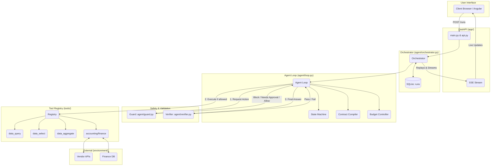

# AI Task Worker Architecture

This document explains the architecture of the AI Task Worker in simple English. The system is designed to be **safe, precise, and free of hardcoding**, meaning it doesn't assume anything about specific vendors, tasks, or numbers.

## Core Principles
1. **The AI only thinks and decides**. It does NOT execute code directly, it does NOT compute math, and it does NOT bypass human approvals.
2. **Code enforces the rules.** Hard constraints, budgets, approvals, and data extraction are done by predictable Python code, not by the LLM guessing.
3. **Everything is a Contract.** When a task starts, it is compiled into a `Contract` that explicitly defines what tools are allowed, what facts are required, and what read-only constraints apply.

## Architecture Diagram (Mermaid)

## How a Task Flows Through the System

1. **Submission (`app/api.py`)**
   - The user submits a task via `POST /api/runs`.
   - The `Orchestrator` (`agent/orchestrator.py`) creates a `Run` and saves it to the SQLite DB.
   - It starts the `Agent Loop` in the background.

2. **Compilation (`agent/contract.py`)**
   - The task text is converted into a structured `Contract`.
   - If the task says "just tell me" or "don't pay", the contract gets a `read_only=True` constraint.

3. **The Loop (`agent/loop.py`)**
   - The agent enters a loop (up to `max_steps`).
   - The `BudgetController` (`agent/budget.py`) ticks down LLM and tool calls.
   - The LLM decides on an action (e.g., call `data_query`).

4. **The Guard (`agent/guard.py`)**
   - Before executing, the `Guard` intercepts the action.
   - It checks: Is it allowed? Is it read-only? Does it need human approval? Is the agent looping?
   - If human approval is needed, the state becomes `WAITING_APPROVAL`, and the loop pauses.

5. **Execution (`tools/registry.py`)**
   - If the Guard allows it (or the human approves), the tool executes.
   - Result is saved in the `ResultStore` so big lists aren't silently truncated.

6. **Verification (`agent/verifier.py`)**
   - When the agent thinks it is finished, it calls `finish`.
   - The `Verifier` independently checks if the answer matches the data, if constraints were respected, and if required facts exist.
   - If it fails, the agent is forced to retry. If it passes, the task is `completed`.

## File Map
- **`app/main.py`, `app/api.py`**: The web server and REST endpoints.
- **`agent/orchestrator.py`**: Manages run persistence, checkpoints, and SSE streaming.
- **`agent/loop.py`**: The central brain driving the Thought -> Guard -> Action -> Verify cycle.
- **`agent/contract.py`**: Translates English tasks into hard rules.
- **`agent/guard.py`**: The bouncer that stops unsafe actions.
- **`agent/verifier.py`**: The inspector that double-checks the final answer.
- **`tools/base.py`, `tools/registry.py`**: Where tool metadata (like `effect="write"` and `requires_approval=True`) lives.
- **`environment/`**: The mock external systems (APIs and Databases) the agent interacts with.
